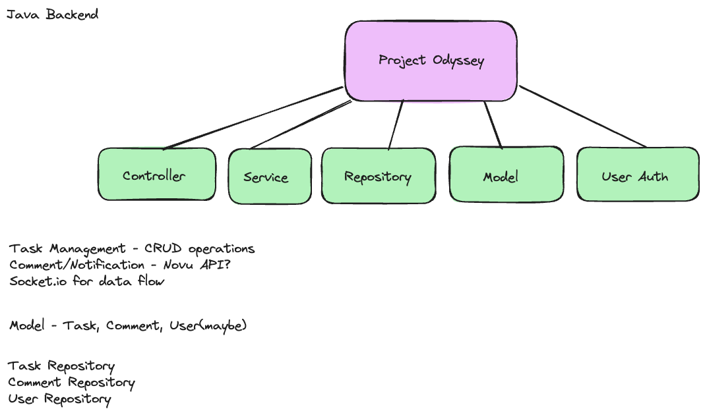

# ProjectOdyssey

**Backend (Java Springboot):**

Testing this if it works

**Framework:** Spring Boot (for simplicity and rapid development)
  
**Database:** MySQL 

**Components:**

- **Controller:** Handles incoming HTTP requests (GET, POST, PUT, DELETE)
- **Service:** Implements business logic, interacts with the database
- **Repository:** Interacts with the database for data access and manipulation
- **Model:** Represents data entities (tasks, comments, users) **4. API Endpoints:**
- User authentication and authorization (login, logout, registration)
- Task management (create, read, update, delete)
- Comment management (create, read, update, delete)
- Potentially real-time updates using Socket.io

**Frontend (React):**

**Libraries:**

- React Router: For navigation between pages or views
- Axios or Fetch API: For making HTTP requests to the backend API
- React Beautiful DND: For drag-and-drop functionality
- Socket.io-client: For real-time communication (if applicable) **2. Components:**
- Task Board: Main component displaying Kanban board columns and tasks
- Task Card: Individual task components with details and actions
- Comment Section: Displays comments for a specific task
- Login/Register: User authentication components
- Forms: For creating and editing tasks and comments 

- **Data Fetching:**
- Fetches task and comment data from the backend API on component mount or user actions
- Potentially listens for real-time updates using Socket.io 

- **User Interactions:**
- Handles user actions like creating, editing, moving, and commenting on tasks
- Updates the UI accordingly
- Novu API for notifications

**Additional Considerations:**

- **Security:** Implement appropriate authentication and authorization measures to protect user data and prevent unauthorized access.
- **Error Handling:** Gracefully handle API errors and display user-friendly messages.
- **State Management:** Consider using a state management library like Redux or Context API for complex applications with shared state.
- **Testing:** Write unit and integration tests to ensure backend and frontend functionality.
